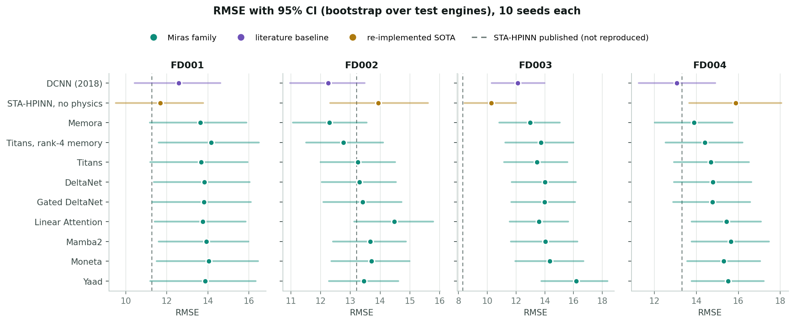
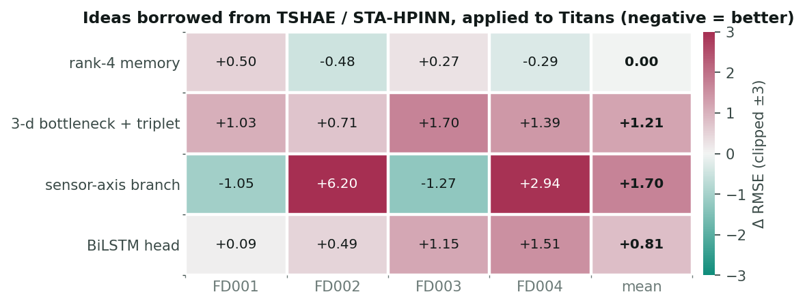
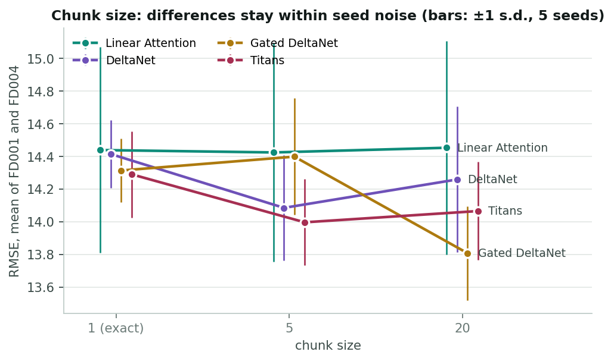

# cmapss-rul-miras

Applying the **Miras** framework (Behrouz et al., *It's All Connected: A Journey Through
Test-Time Memorization, Attentional Bias, Retention, and Online Optimization*,
arXiv:2504.13173, Google Research 2025) to remaining-useful-life (RUL) prediction of
turbofan engines on **NASA C-MAPSS**, and comparing it against the state of the art
**inside one shared pipeline**.

## Main results

RMSE, 10 seeds per cell. 95% confidence intervals (bootstrap over test engines) and paired
tests are in [`results/MIRAS_FIX.md`](results/MIRAS_FIX.md).

| model | FD001 | FD002 | FD003 | FD004 | mean |
|---|---|---|---|---|---|
| DCNN (Li et al. 2018) — reference | 12.58 | 12.25 | 12.12 | 13.07 | **12.50** |
| STA-HPINN without physics loss — re-implemented SOTA | 11.69 | 13.94 | **10.27** | 15.88 | 12.95 |
| **Miras / Memora** (KL retention) | 13.64 | 12.30 | 12.99 | 13.88 | **13.20** |
| Miras / Titans | 13.67 | 13.25 | 13.46 | 14.69 | 13.77 |
| Miras / Titans, rank-4 memory | 14.17 | 12.77 | 13.73 | 14.40 | 13.77 |
| Miras / DeltaNet, Gated DeltaNet | 13.8 | 13.3–13.4 | 14.0 | 14.8 | 13.98–13.99 |
| Miras / Linear Attention, Mamba2, Moneta | 13.7–14.0 | 13.7–14.5 | 13.6–14.3 | 15.3–15.7 | 14.31–14.35 |
| Miras / Yaad | 13.88 | 13.45 | 16.18 | 15.52 | 14.75 |
| Titans + sensor-axis branch | **12.62** | 19.45 | 12.19 | 17.63 | 15.47 |
| *STA-HPINN — published (not reproduced)* | *11.27* | *13.21* | *8.30* | *13.31* | *11.52* |



Confidence intervals overlap heavily: with 100–259 test engines per subset, a single cell's
CI is about ±2 RMSE wide, wider than the spread between most methods.

**Findings**
- The best Miras model (**Memora**) trails DCNN by 0.70 mean RMSE, but the difference is
  **not significant** on FD001–FD003 (paired bootstrap + Holm); only FD004 is (+0.81).
- On the multi-condition subsets (FD002, FD004) Memora edges out the re-implemented
  STA-HPINN (−1.64 / −2.00 RMSE; 95% CI excludes 0 but not significant after Holm); on the
  single-condition subsets (FD001, FD003) it is significantly worse (+1.95 / +2.71).
- **Chunk approximation is not the cause**: exact recurrence (chunk 1) is no better than
  chunk 5 or 20 (differences ≤ 0.6).
- Ideas borrowed from TSHAE / STA-HPINN: low-rank memory ≈ no change; bottleneck + triplet
  loss **hurts** (+1.2); a Miras branch over the sensor axis is **best on FD001/FD003**
  (on par with DCNN) but **collapses on FD002/FD004** — it fails on multi-condition data.
- The BiLSTM head from Ren et al. **hurts** Titans (13.77 → 14.58).





## Miras implementation

`code/miras.py` — a single layer; variants are choices along the Miras design axes:

| variant | attentional bias | retention gate |
|---|---|---|
| `linear_attn` / `mamba2` | dot product (Hebbian) | none / data-dependent α_t |
| `deltanet` / `gated_deltanet` | ℓ2 (delta rule) | none / α_t |
| `titans` | ℓ2 + momentum | α_t |
| `moneta` | ℓp (p = 3) | ℓq normalization (q = 4) |
| `yaad` | Huber | α_t |
| `memora` | ℓ2 | KL / softmax |
| `elastic`, `robust`, `retnet`, `titans_mlp` | see docstrings | |

Extra options: `rank` (low-rank memory), `sensor_branch` (non-causal branch over the
sensor axis), `bottleneck` + triplet loss. Training is chunk-parallel (§5.4 of the paper);
`chunk=1` is the exact recurrence.

**Bugs fixed in 09-2026** (earlier Memora, Titans and sensor-branch numbers are invalid):
Memora ascended the gradient (sign error); Titans lost its momentum across chunk
boundaries; the sensor branch used a causal mask over an unordered axis; the `rank_bias`
variant was removed (its premise was wrong).

## Shared pipeline

14 standard sensors; window 40 (FD001) / 60 (others); min-max scaling (FD001/FD003);
per-operating-condition normalization (FD002/FD004); RUL capped at 125 with the
**training cap kept separate from the evaluation cap**; 20% of training engines held out
for validation; early stopping on validation; the test set is scored once.
Significance: bootstrap over **engines** (the correct sampling unit), not a Wilcoxon test
over individual windows.

## Running

```bash
bash scripts/fetch_cmapss.sh                    # -> data/CMAPSSData
cd code
python train_miras_fix.py --root ../data/CMAPSSData --outdir ./out \
    --subsets FD001 --ideas memora,titans,dcnn --chunks 5 --seeds 0,1,2
python report_mfix.py --dir ./out
```

On a GPU cluster: `code/run_miras_fix.sh` (three parallel groups, ~640 runs, ~10 h on
shared V100s).

## Background (earlier phases)

The project began by reproducing SBi-Transformer (Ren et al., *Results in Engineering*
2026) — **not reproducible**: the published numbers fall outside the 95% CI on all four
subsets. It then re-implemented STA-HPINN (arXiv:2405.12377), whose physics-informed
component turned out to hurt; ran 7 literature baselines; and ran a 3-stage automated
search. About 2,900 training runs in total. See [`SUMMARY.md`](SUMMARY.md), `results/*.md`,
and every run in [`results/all_runs.csv`](results/all_runs.csv).

| file | contents |
|---|---|
| `code/data.py` | C-MAPSS loading, normalization, windowing, labels |
| `code/miras.py` | the Miras family |
| `code/sta_hpinn.py`, `code/rve.py`, `code/baselines.py`, `code/model.py` | SOTA, TSHAE, baselines, SBi-Transformer |
| `code/stats.py` | engine-level bootstrap CIs, paired comparisons, Holm correction |
| `code/autoresearch.py`, `code/ablate.py` | automated search, isolated ablation |
